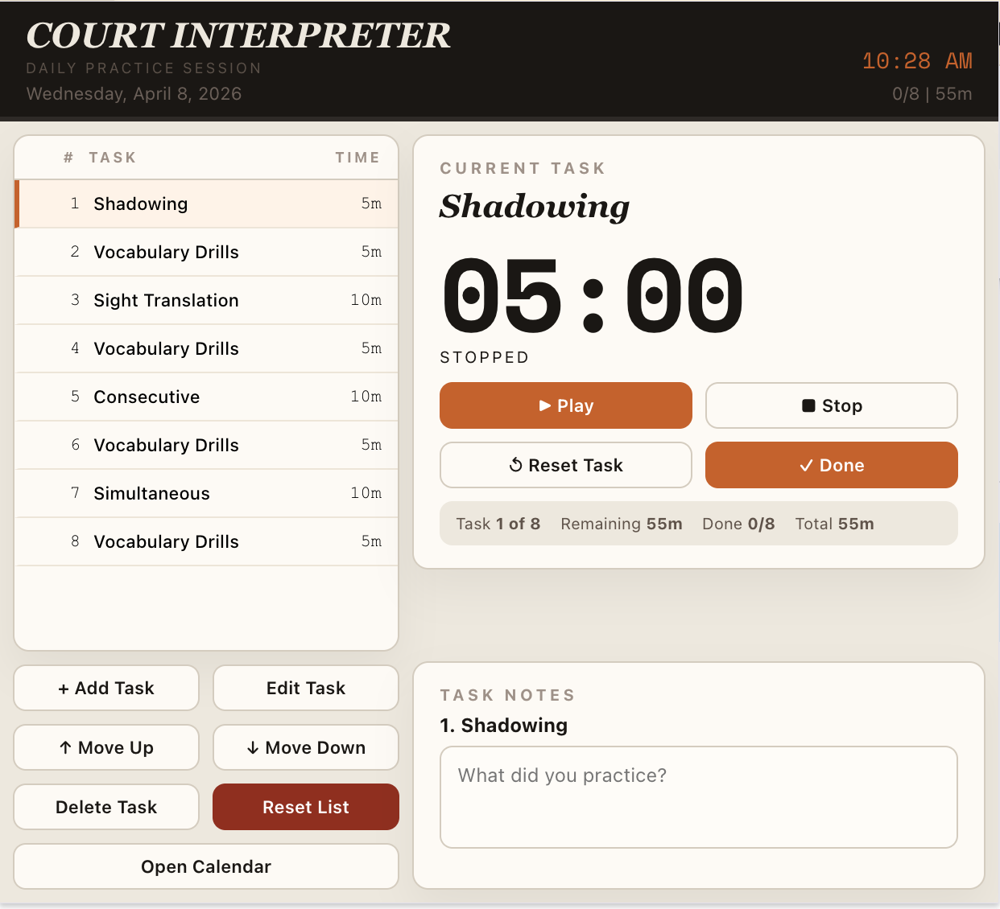

# Court Interpreter Toolkit

Practice tool for court interpreters with timed sessions, vocabulary drills, and task management.

Court Interpreter Toolkit helps court interpreters run structured daily practice sessions from the browser toolbar. Create and edit task lists, run timed drills task-by-task, track completed sessions by date, and keep notes for each task. The timer continues in the background so progress is not lost when the popup closes. Toolbar and context-menu controls let you Play, Stop, and mark tasks Done quickly. A calendar view highlights fully completed days for easy review of consistency over time.

Ideal for seasoned interpreters looking to refine their skills, court interpreters preparing for the Court Interpreter Certification Exam, and anyone wanting to improve their interpreting proficiency.

## Highlights

- Structured daily practice workflow in a compact browser popup.
- Task-by-task timed drills with background timer continuity.
- Quick controls from the extension icon context menu.
- Calendar visibility into completed practice days.
- Task notes for focused review and repetition.
