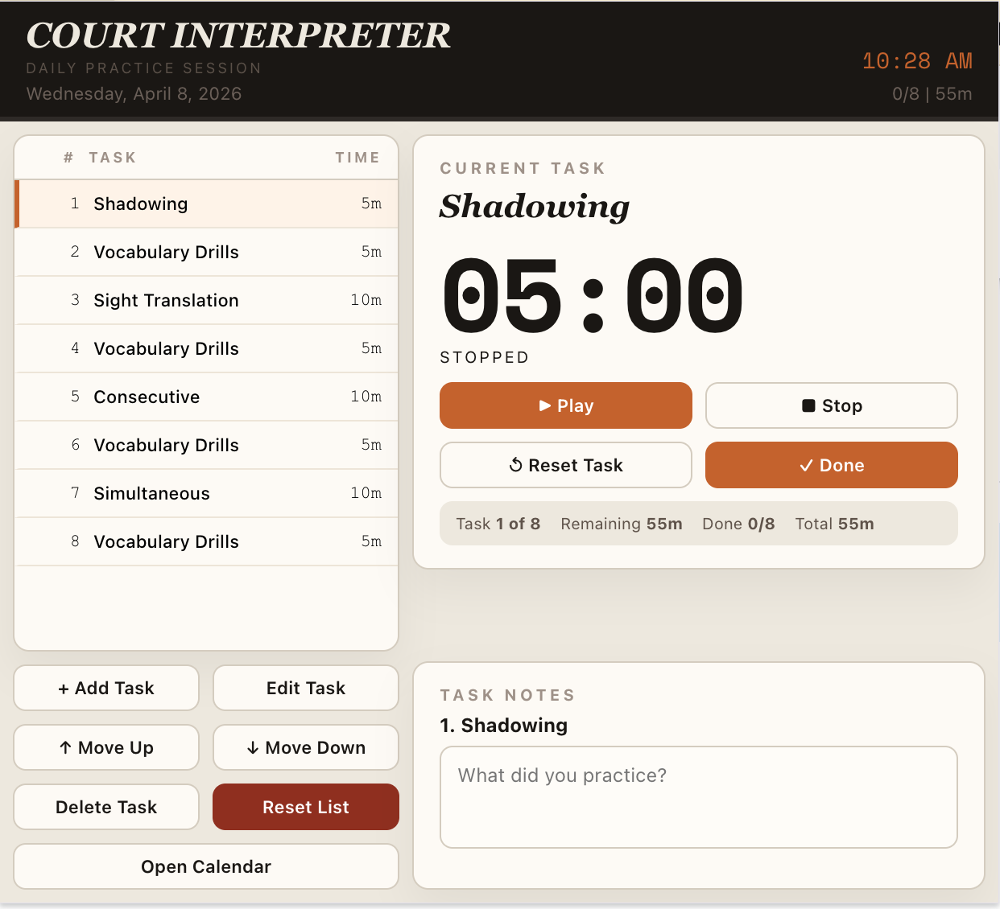

# Court Interpreter Toolkit

A local-first Chrome extension for structured court-interpreter practice: timed task drills, daily history, and per-task notes.



Court Interpreter Toolkit helps court interpreters run structured daily practice sessions from the browser toolbar. Create and edit task lists, run timed drills task-by-task, track completed sessions by date, and keep notes for each task. The timer continues in the background so progress is not lost when the popup closes. Toolbar and context-menu controls let you Play, Stop, and mark tasks Done quickly. A calendar view highlights fully completed days for easy review of consistency over time.

Ideal for seasoned interpreters looking to refine their skills, court interpreters preparing for the Court Interpreter Certification Exam, and anyone wanting to improve their interpreting proficiency.

Product page: https://court-interpreter-toolkit.cod3naut.com/

## Highlights

- Structured daily practice workflow in a compact browser popup.
- Task-by-task timed drills with background timer continuity across service-worker suspension/restart.
- Quick controls from the extension icon context menu (Play, Stop, Done).
- Calendar visibility into completed practice days, backed by a single summary query.
- Read-only history view: browsing a past day never touches today's active session or timer.
- Task notes for focused review and repetition.
- Completion alarm (optional, toggled in Options).

## Local-first / privacy model

All practice data (template, daily sessions, notes, settings) is stored locally in the browser via IndexedDB and `chrome.storage.local`. There is no account system, no remote server, no analytics, and no telemetry. Nothing leaves the browser.

## Architecture

```text
Popup / Options
    │  typed chromeRPC commands (chrome.runtime.sendMessage)
    ▼
background/sessionManager  ── single runtime authority
    │
    ├─ timerRuntime          persisted deadline (endsAtMs) in chrome.storage.local
    ├─ sessionTransitions    one shared "complete current task, advance" helper
    │
    ▼
shared/indexedDB  ── template + daily session storage (IndexedDB)
    │
    ▼
chrome.action / chrome.contextMenus  ── toolbar badge/title + context menu refresh
```

Key invariants:

- The background `sessionManager` owns the one active practice session, the timer, the toolbar, and the context menu. The popup never pushes its own runtime snapshot back into the toolbar.
- Timer truth is a persisted deadline (`endsAtMs`), not an in-memory tick counter, so remaining time survives Manifest V3 service-worker suspension and restart without drift.
- Viewing a past date (`readStateByDate`) is strictly read-only: it never replaces the active session, never touches the timer, and is never autosaved.
- Task mutations (select, add, edit, delete, move, reset list, change date) pause the timer first and abort if the pause fails, instead of silently continuing.

## Source tree

```text
src/
  background/
    sessionManager.ts     background runtime authority (timer, toolbar, context menu, RPC handlers)
    timerRuntime.ts        persisted-deadline runtime record (load/save/validate)
    sessionTransitions.ts  shared "complete task and advance" logic
    __tests__/             direct sessionManager tests (restart, expiry, idempotency, etc.)
  pages/
    background/index.ts    service-worker entry point, message/alarm/menu wiring
    popup/
      SessionPopup.tsx          composition root
      usePracticeSession.ts     all popup state, RPC calls, autosave/error/race-safety logic
      SessionWorkspace.tsx      presentational task list / timer / notes
      SessionCalendarPopover.tsx  calendar popover (own open state, positioning, month nav)
      TaskEditorDialog.tsx      add/edit task modal
      sessionPopupUtils.ts      small date/calendar/error-formatting helpers
    options/                Options page (completion alarm toggle)
  shared/
    practice.ts             practice domain types + pure session/template logic
    indexedDB.ts             IndexedDB access (template, sessions, summaries)
  utils/
    chromeRPC.ts             typed wrapper over chrome.runtime.sendMessage
public/
  welcome.html, alarm-player.html/js, icons, screenshot.png
```

## Prerequisites

- Node.js `24.18.0` (see [`.nvmrc`](.nvmrc))
- [pnpm](https://pnpm.io/) `11.9.0`

## Getting started

```bash
pnpm install
pnpm dev            # watches src/, public/, and manifest.dev.json, rebuilding dist_chrome on change
```

`pnpm dev` builds a **development** extension: it merges `manifest.dev.json` over the production manifest, so Chrome shows it as "Court Interpreter Toolkit (Development)" with a visually distinct icon (`public/dev-icon-32.png` / `dev-icon-128.png`) and emits source maps. This lets a dev build and the Chrome Web Store production build be loaded side by side without name/icon collisions.

Load the unpacked extension in Chrome:

1. Build once with `pnpm build:chrome` (production) or run `pnpm dev` (development, watch mode).
2. Open `chrome://extensions`, enable **Developer mode**.
3. Click **Load unpacked** and select the `dist_chrome/` directory.

## Scripts

```bash
pnpm lint                # eslint .
pnpm typecheck           # tsc --noEmit
pnpm test                # vitest run
pnpm build:chrome        # production build to dist_chrome/ (vite --mode production)
pnpm build:chrome:dev    # development build to dist_chrome/ (vite --mode development)
pnpm verify:chrome-build -- production|development   # asserts the last dist_chrome/ build matches that mode
pnpm check:build         # production build+verify, leaving dist_chrome/ as the production artifact
pnpm ladle:build         # builds the Ladle story catalog to ./build (repository-local)
pnpm detect-duplicates   # exact TypeScript/TSX clone detection with jscpd
pnpm similarity          # structural TypeScript similarity; requires similarity-ts on PATH
pnpm duplicates          # combined exact + structural report written under tmp/
pnpm check               # lint + typecheck + coverage + exact duplicate scan + check:build
pnpm build:zip           # build:chrome, verify it, then zip dist_chrome into tmp/
```

`pnpm check` is the automated production quality gate. It runs linting, TypeScript checking, coverage with configured thresholds, exact clone detection, and a clean production Chrome build followed by artifact verification.

Run `pnpm ladle:build` when story files or Ladle configuration change. Run `pnpm duplicates` when performing a broader duplicate review that includes `similarity-ts` structural analysis.

## Test strategy

- `src/shared/__tests__/` — pure session/template reconciliation logic and IndexedDB (summaries, hard reset).
- `src/background/__tests__/sessionManager.test.ts` — the background runtime directly: deadline persistence, idempotent materialization, service-worker-restart simulation (via `vi.resetModules()` + dynamic re-import), expiry/completion, date-rollover, malformed-runtime safety, and context-menu commands, against a reusable `chrome.*` mock (`src/test/chromeMock.ts`) and `fake-indexeddb`.
- `src/pages/popup/__tests__/` and `src/pages/options/__tests__/` — UI behavior: load failure/retry, history read-only isolation, blocking pause-before-mutation, race-safe date navigation, running-state polling.

Run everything with `pnpm check` before opening a PR.

## Release

```bash
pnpm build:zip
```

Produces `tmp/court-interpreter-v<version>.zip` from a fresh `dist_chrome/` build, ready to upload to the Chrome Web Store. Chrome is the only supported release target for this repository.

## Links

- Product: https://court-interpreter-toolkit.cod3naut.com/
- Chrome Web Store: https://chromewebstore.google.com/detail/court-interpreter-toolkit/ghbnejickfddbmfjkgofklghbmaambhb
- Source: https://github.com/iknowmagic/court-interpreter-toolkit-chrome
